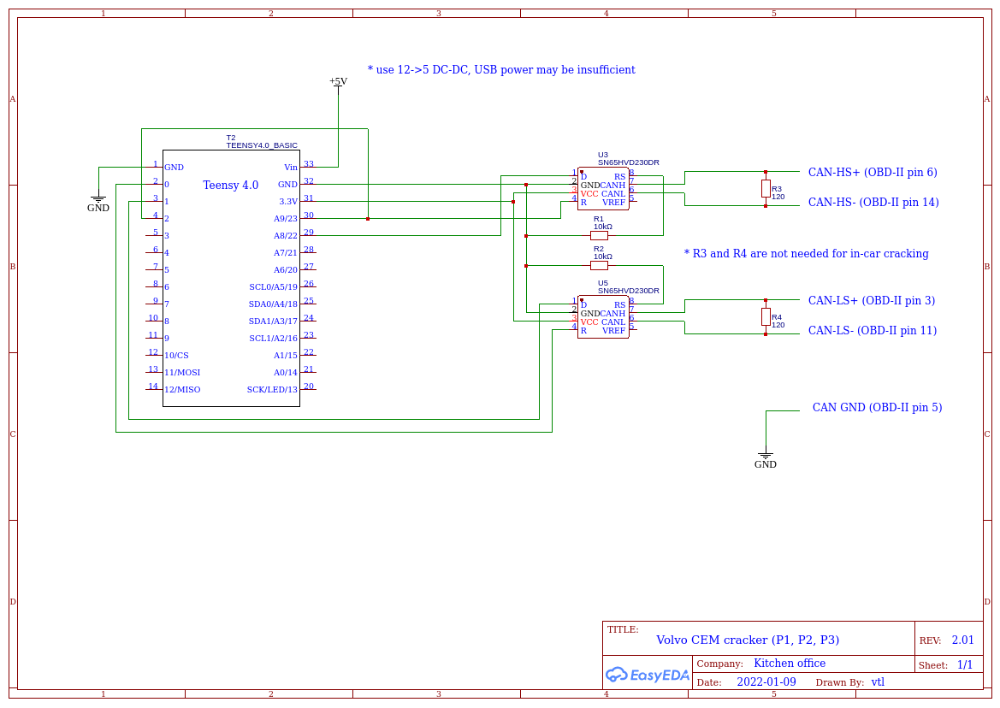
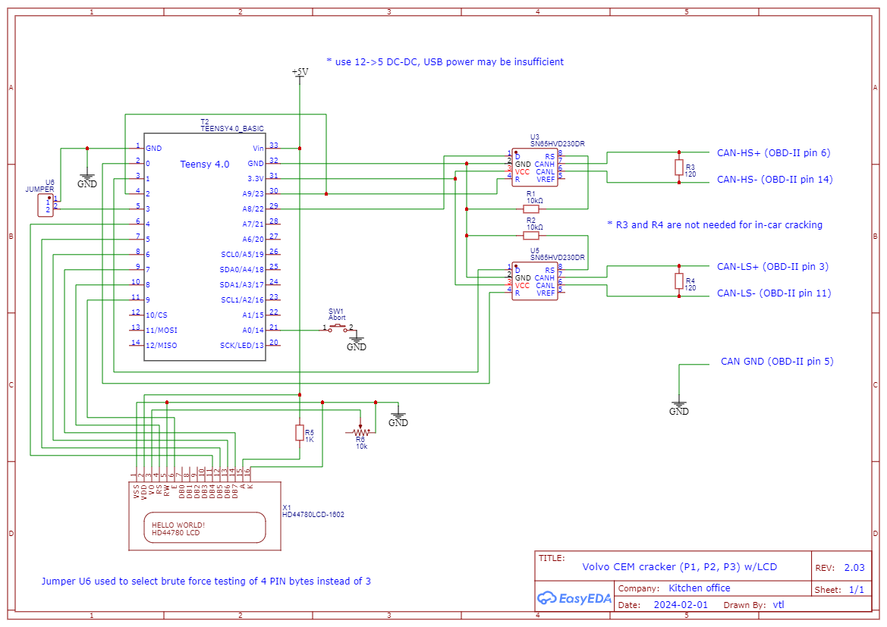
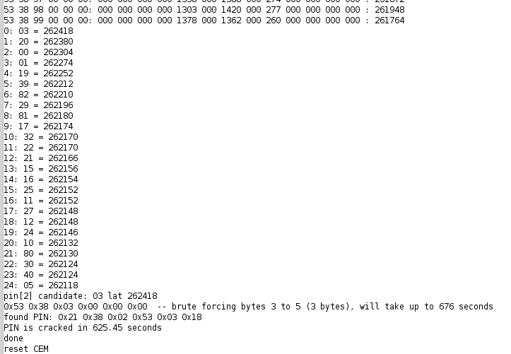

# Volvo CEM pin cracker via OBD

A research project grown out of curiosity. Cracks 6 bytes of pin code via High Speed CAN-bus in under 20 minutes.

## Supported platforms:

* P1:
  * 2004 - 2011 S40
  * 2004 - 2011 V50
  * 2008 - 2013 C30
  * 2006 - 2013 C70
* P2:
  * 2005 - 2006 S80
  * 2005 - 2007 V70
  * 2005 - 2007 XC70
  * 2005 - 2009 S60
  * 2003 - 2014 XC90

Earlier P2 1999-2004 can be supported as well, CEM donation is welcome.

Find us at Matthew's Volvo Site for support: https://www.matthewsvolvosite.com/forums/viewtopic.php?f=10&t=85611

Big thanks to an unidentified hacker from western Germany for hints!



An optional LCD display can be added for stand-alone operation.





Cracking CEM pin in about 10 minutes (video):

[](http://www.youtube.com/watch?v=w8GS_1SFgeg "Cracking CEM pin in about 10 minutes")

## Possible issues and fixes
Depending on your CEM model, you may face some issues with PIN decoding. Here are some examples and recommendations.

### CEM 30786889
#### Unable to decode 3rd byte.
Cracker decodes first 2 bytes, but the third byte is always different so PIN cannot be decoded. For example:

```
Attempt 1:
21:54:30.212 -> Candidate PIN 32 78 79 -- -- -- : brute forcing bytes 3 to 5 (3 bytes), will take up to 646 seconds
...
Attempt 2:
22:30:45.288 -> Candidate PIN 32 78 78 -- -- -- : brute forcing bytes 3 to 5 (3 bytes), will take up to 646 seconds

Attempt 3:
23:06:12.024 -> Candidate PIN 32 78 02 -- -- -- : brute forcing bytes 3 to 5 (3 bytes), will take up to 646 seconds

Attempt 4:
14:26:13.327 -> Candidate PIN 32 78 41 -- -- -- : brute forcing bytes 3 to 5 (3 bytes), will take up to 646 seconds
```

There are two possible solutions that may help:
1. Use brute force for rest of bytes - it may take 18-20 hours. To do it, change the following tunable parameter value to 2:
```
#define CALC_BYTES     3     /* how many PIN bytes to calculate (1 to 4), the rest is brute-forced */
```

2. Another solution that may help - comment out the following line:
```
set_arm_clock (180000000);
```

And to avoid time waste, hardcode the first two bytes that you already know:
```
  /* try and crack each PIN position */
  
  // Add lines to skip first known bytes */
  pin[0] = 0x32; // Known first byte example
  pin[1] = 0x78; // Known second byte example

  // Change initial value of i from 0 to 2
  for (i = 2; i < maxBytes; i++) {
    crackPinPosition (pin, i, verbose);
  }
```

# Raspberry Pi Port

This project has been ported to run on a **Raspberry Pi Zero 2 W** equipped with a **Waveshare RS485 CAN HAT**.

## Hardware Setup
1.  **Raspberry Pi Zero 2 W** (or 3/4).
2.  **Waveshare RS485 CAN HAT** (MCP2515 based).
3.  **OLED Display** (SSD1306 128x64 I2C) - Optional, for status monitoring.
4.  **OBD2 Cable** connected to CAN High/Low.

## Software Architecture
*   `src/volvo_cracker.py`: Main Python script port of the Arduino logic.
*   `src/oled_monitor.py`: Service to display status and IP address on the OLED.
*   `services/`: Systemd unit files.
*   `deploy/`: Ansible playbooks for automated deployment.

## Deployment (Ansible)
You can deploy the software to a remote Raspberry Pi using Ansible.

1.  Edit `deploy/inventory` to set your Pi's IP address and user.
2.  Run the playbook:
    ```bash
    export ANSIBLE_HOST_KEY_CHECKING=False
    ansible-playbook -i deploy/inventory deploy/playbook.yml
    ```
    *Note: Ensure you have SSH access to the Pi (e.g., via `ssh-copy-id`).*

## Usage
The software is installed as a systemd service (`volvo-cracker.service`) and starts automatically on boot.

### Manual Run
To run manually for debugging:
```bash
cd ~/volvo-cem-cracker
./run.sh
```

### Logs
Check the logs at:
```bash
tail -f ~/volvo-cem-cracker/crack.log
```

